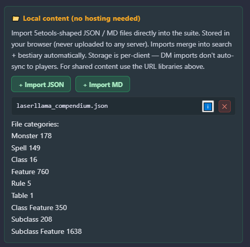
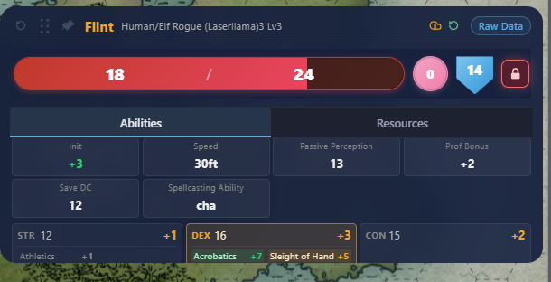
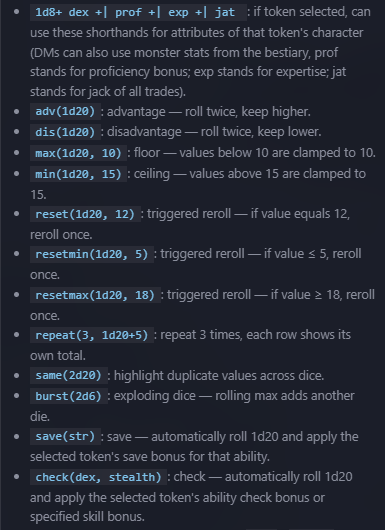
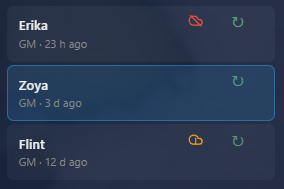

# Full Suite

<p align="center">
  
</p>

An [Owlbear Rodeo](https://owlbear.rodeo) extension that bundles eight modules behind a single manifest: dice, initiative tracker, bestiary, character cards, global search, time stop, sync viewport, and portals.

```
https://obr-suite-custom.pages.dev/suite/manifest-dev.json
```

---

##  Documentation

| | |
|---|---|
|  中文 | [README.zh.md](./README.zh.md) |
|  English | [README.en.md](./README.en.md) |

---

## Added from original
1 - A more deep import from 5e tools jsons
 <p align="center">
  
</p>
2 - a fully translated english adaptation
 <p align="center">
  
</p>
3 - An extended expression system for dice rolling
 <p align="center">
  
</p>

## Future milestones
1 - A System to character card sync with server (WIP)
 <p align="center">
  
</p>
2 - a Downloadable xlsx Character sheet in english
3 - the import of character card data from MPMB's PDF sheets

---

## License

[GNU General Public License v3.0](./LICENSE) — strong copyleft. Copy / modify / redistribute / use commercially, provided derivative works keep the GPL-3.0 license and source.

Copyright © 2026 FullPeople — [github.com/FullPeople](https://github.com/FullPeople)

The `bubbles` module is informed by [Stat Bubbles for D&D](https://github.com/SeamusFinlayson/Bubbles-for-Owlbear-Rodeo) by Seamus Finlayson, also under GPL-3.0.
